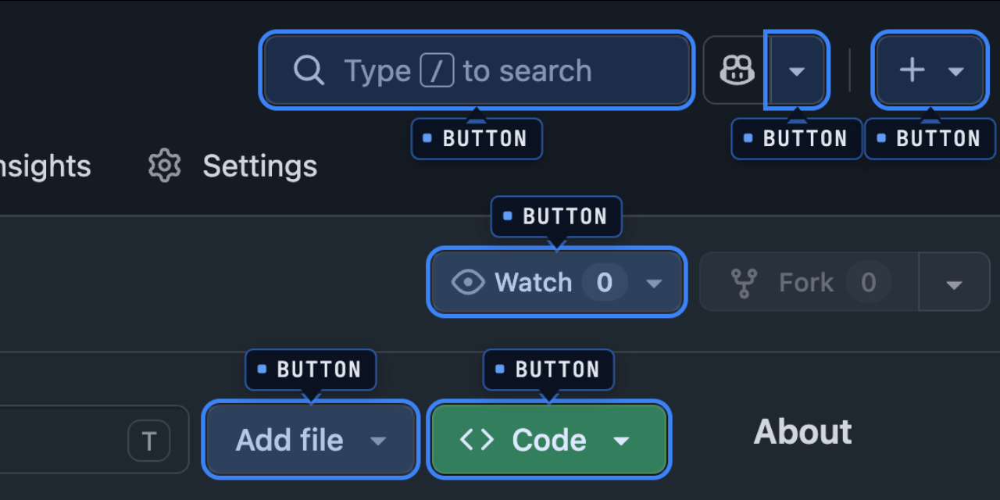

# Component Highlighter Chrome Extension



Chrome extension to highlight HTML elements on any page by matching a configurable data-attribute. Works in all Chromium-based browsers: Chrome, Brave, Arc, Edge, Opera.

## Installation (Development)

1. Enable Developer mode at `chrome://extensions/` (or `brave://extensions/`, etc.)
2. Click "Load unpacked extension..." and select the `extension/` folder
3. Reload the extension after JS or CSS changes

## Configure

Before using, open the extension options page (right-click the icon → Options) and set the **data-attribute name** to match your app's attribute (e.g. `data-component`, `data-testid`). Save. Then reload the target page.

## Features

Adds a colored outline around each matched element.

### Pop-Up Menu

The popup shows a component count for the current page and offers three search modes:

- **All Components** — highlight every element with the configured attribute
- **Selected Component** — pick one value from the list of attributes found on the page
- **Custom Component** — partial string match (e.g. find all elements whose attribute value contains "button")

Enable **Show info labels** to display the attribute value as a badge on each matched element.

Press **Activate** to start highlighting. The button toggles to **Deactivate** to remove all highlighting.

### Options Page

Right-click the extension icon and choose the menu option to open the options page. Configure:

- **Highlight Color** — color used for component outlines, badge accents, and info labels (default: `#3b82f6`)
- **Data Attribute** — attribute name to scan for (default: `data-component`)
- **Custom CSS** — override default highlight styling. Target `.highlighted-component` for matched elements and `.info-layer` for value labels.

> **Note**: Changing the data-attribute does not re-scan already-loaded tabs. Reload the tab or press Activate in the popup to apply the new attribute.

## Release

Build a distributable ZIP for Chrome Web Store submission:

```bash
./release.sh [patch|minor|major]
# Output: dist/component-highlighter-<version>.zip
```

Bumps the version in `manifest.json`, commits the change, creates a git tag, and packages the extension.
